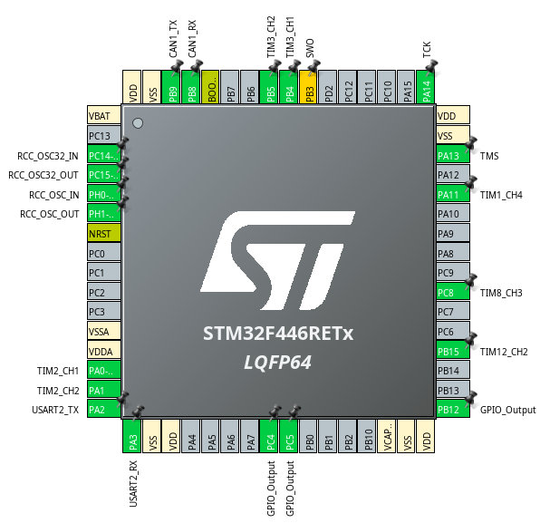

# AccurateProject
2025年部内ロボコン「キアイダケ」チームのソフトウェア、ハードウェアについて

|name|link|
|:--:|:--:|
|マイコンソフトウェア||

# マイコンソフトウェア「AccurateHardware」

# マイコン制御基盤「AccurateBoard」

# 電源基盤「MainPowerSupplyer」

# 分電基盤「PowerDivider」

